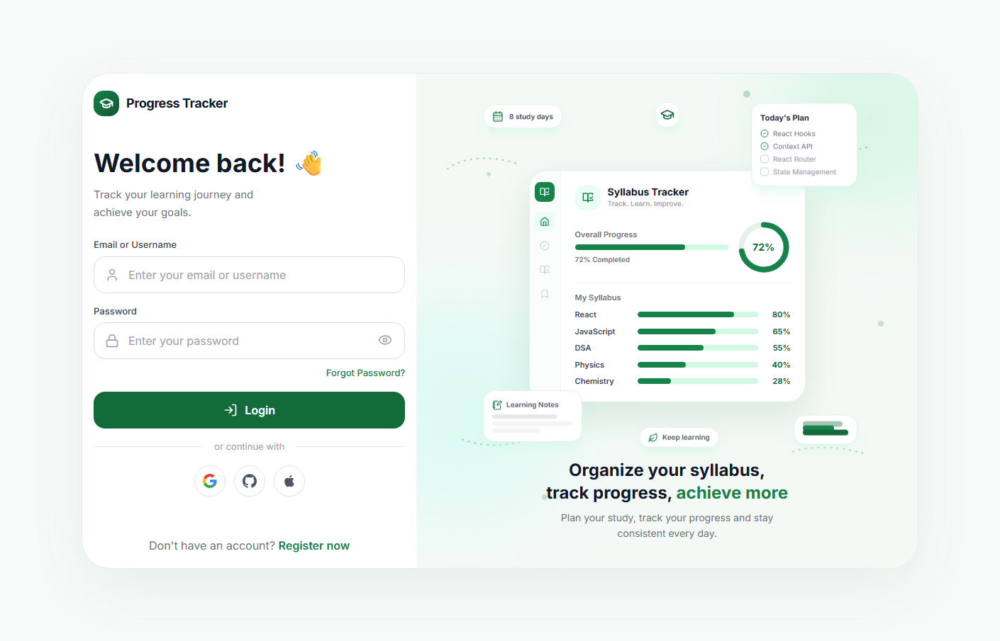

# 📚 Syllabus Tracker

A production-ready **MERN** learning platform that turns a full syllabus into an actionable, trackable plan — **modules → topics → subtopics → status**, all wired to live progress bars, streaks, and charts.

Track your **MERN Stack**, **DSA** and **PCM** learning paths, mark subtopics as you go, keep private notes, and stay consistent with streaks and a GitHub-style activity heatmap. Responsive across mobile and desktop, deployed and live.

**Live app** → [https://syllabus-tracker-beta.vercel.app](https://syllabus-tracker-beta.vercel.app)

<p align="center"></p>

---

## ✨ Features

- **Multiple learning paths** — pick MERN, DSA or PCM when you register; each has a seeded, read-only master syllabus.
- **Status tracking** — mark every subtopic `Not Started`, `In Progress` or `Completed`; stored in MongoDB as the single source of truth.
- **Progress everywhere** — overall, per-module and per-topic progress, recomputed on the backend (never hardcoded in the UI).
- **Custom content** — add your own modules, topics and subtopics (marked ⭐ Custom); edit/delete only your own. Official content can't be modified.
- **Notes & resources** — private per-subtopic notes, plus resources attached to subtopics.
- **Continue learning** — jumps straight to your most recently active in-progress subtopic.
- **Streaks & heatmap** — 🔥 day streak and a GitHub-style activity heatmap computed from DB records.
- **Search & filters** — search across the syllabus, filter by status, custom and difficulty.
- **Dashboard** — circular progress, stat cards, module progress and recent completions.
- **Charts** — status pie, per-module bar chart and difficulty breakdown (Recharts).
- **Secure auth** — JWT in HTTP-only cookies, bcrypt password hashing, protected routes and ownership checks.
- **Responsive** — desktop sidebar + mobile drawer; single-column mobile layouts across every page.

---

## 🧱 Tech Stack

| Layer      | Tech |
|------------|------|
| Frontend   | React 18, Vite, Tailwind CSS, React Router, Framer Motion, Axios, Recharts, Lucide |
| Backend    | Node.js, Express, MongoDB, Mongoose, JWT, bcrypt |
| Deployment | Frontend → Vercel · Backend → Render · Database → MongoDB Atlas |
| Dev        | JavaScript (ESM), ESLint, Postman |

---

## 📁 Project Structure

```text
syllabus-tracker/
├── frontend/                  # Vite + React app
│   ├── public/                # static assets (favicon)
│   └── src/
│       ├── components/        # Layout, Sidebar, modals, progress UI…
│       ├── pages/             # Auth (login/register), Dashboard, Syllabus, etc.
│       ├── context/           # Auth, Progress, Toast providers
│       ├── services/api.js    # Axios instance + error helpers
│       ├── hooks/             # useDebouncedValue
│       ├── utils/             # status/difficulty helpers
│       ├── App.jsx
│       └── main.jsx
├── backend/
│   ├── config/db.js
│   ├── controllers/           # auth, module, topic, subTopic, progress
│   ├── middleware/            # auth, error, validation
│   ├── models/                # User, Module, Topic, SubTopic, Progress
│   ├── routes/                # REST routes
│   ├── seed/                  # seedSyllabus.js + syllabusData.js
│   ├── utils/                 # token, syllabus tree builder, analytics
│   └── server.js
├── render.yaml                # Render Blueprint (backend + optional frontend)
└── README.md
```

---

## 🚀 Getting Started

### Prerequisites

- Node.js 18+
- MongoDB (local) or MongoDB Atlas

### 1. Backend

```bash
cd backend
npm install
cp .env.example .env        # edit MONGO_URI, JWT_SECRET, etc.
npm run seed                # insert the official MERN syllabus (idempotent)
npm run dev                 # http://localhost:5000
```

### 2. Frontend

```bash
cd frontend
npm install
cp .env.example .env        # optional: point VITE_API_URL at your backend
npm run dev                 # http://localhost:5173
```

Open **https://syllabus-tracker-beta.vercel.app/** → register → your chosen learning-path syllabus appears on the Syllabus page.

---

## 🌍 Deployment

### Frontend — Vercel

- Root is `frontend/`; Vercel auto-detects Vite and the included `vercel.json` rewrites every route to `index.html`, so React Router deep links (e.g. `/login`, `/dashboard`) work.
- Set `VITE_API_URL` (the backend base URL, e.g. `https://your-backend.onrender.com/api`) in Vercel's Environment Variables. It's baked in at **build time**.

### Backend — Render (Web Service)

- Root is `backend/`. Required environment variables:

  | Variable      | Example |
  |---------------|---------|
  | `NODE_ENV`    | `production` |
  | `CLIENT_URL`  | `https://your-frontend.vercel.app` (**no trailing slash**) |
  | `MONGO_URI`   | your Atlas connection string |
  | `JWT_SECRET`  | a long random string |

- Run the seed once after the service starts. Each redeploy pulls the latest code from git.

### Database — MongoDB Atlas

- Create a cluster and put the connection string in `MONGO_URI`.

### Cross-origin auth (Vercel ⇄ Render)

The frontend and backend live on different origins, so:

- `CLIENT_URL` must be exactly the frontend origin **without a trailing slash** — a trailing slash breaks the CORS `Origin` string match and silently blocks browser requests.
- The backend normalizes configured origins (strips trailing slashes) so a mismatch can't happen. Any unlisted origin is rejected.
- With `NODE_ENV=production`, auth cookies are sent as `Secure` + `SameSite=None`, which is required for cross-origin `withCredentials` requests.

### Optional: everything on Render

Prefer to host the frontend on Render too? Use the included `render.yaml` Blueprint and `frontend/server.js` (`npm start`) as a static server with SPA fallback — it serves the built app and does **not** proxy `/api`.

---

## 🔌 API Overview

| Method | Endpoint | Description |
|--------|----------|-------------|
| POST | `/api/auth/register` | Register (name, email, password) |
| POST | `/api/auth/login` | Login, sets HTTP-only cookie |
| POST | `/api/auth/logout` | Clears session |
| GET  | `/api/auth/me` | Current user |
| GET  | `/api/modules/tree` | Full syllabus tree with user progress |
| GET/POST | `/api/modules` | List / create custom module |
| PUT/DELETE | `/api/modules/:id` | Edit/delete custom module (owner only) |
| GET/POST | `/api/topics` | List / create custom topic |
| PUT/DELETE | `/api/topics/:id` | Edit/delete custom topic (owner only) |
| GET/POST | `/api/subtopics` | List / create custom subtopic |
| PUT/DELETE | `/api/subtopics/:id` | Edit/delete custom subtopic (owner only) |
| GET | `/api/progress` | User progress with context |
| GET | `/api/progress/stats` | Aggregated stats for dashboard/charts |
| GET | `/api/progress/activity` | Streak + heatmap data |
| PUT | `/api/progress/:subTopicId` | Set status for a subtopic |
| POST | `/api/progress/:subTopicId/notes` | Save personal notes |
| DELETE | `/api/progress` | Reset user's progress |

All `/api/*` routes except `register` and `login` are protected by JWT.

---

## 🧠 How Progress Works

- Progress lives in a dedicated `Progress` collection keyed by `userId + subTopicId`.
- Overall/module/topic percentages are **calculated on the backend** from the user's progress records — never hardcoded in React.
- Custom topics/subtopics automatically take part in progress calculations.
- The master syllabus is shared (not duplicated per user); custom content is flagged `isCustom: true` + `createdBy`.

---

## ✅ Scripts

Backend:
- `npm run dev` — nodemon dev server
- `npm run start` — production server
- `npm run seed` — seed/reset the official syllabus (idempotent)

Frontend:
- `npm run dev` — Vite dev server
- `npm run build` — production build
- `npm run lint` — ESLint

---

## 🛡️ Security Notes

- Passwords hashed with bcrypt.
- JWT stored in HTTP-only cookies (`SameSite=Lax` locally, `SameSite=None` + `Secure` in production).
- Every mutation checks ownership before allowing edits/deletes.
- Input validated with express-validator; MongoDB `CastError` handled.
- `.env` holds secrets (`JWT_SECRET`, `MONGO_URI`); never commit `.env`.
